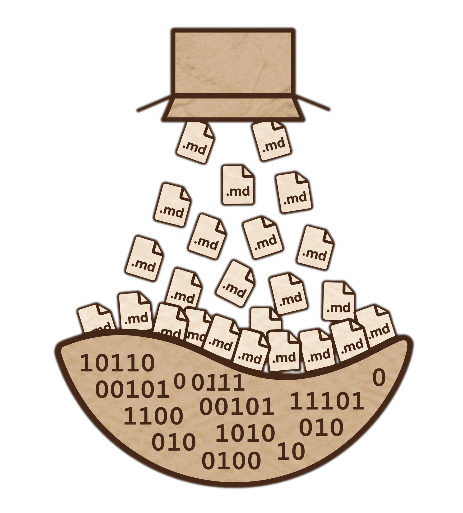

<p align="center">
  
</p>

<h1 align="center">Substrato</h1>

<p align="center">
  <a href="README.en.md">English</a> | <a href="README.md">Português</a>
</p>

Substrato é um pacote neutro de skills em Markdown para agentes de IA no
terminal. Ele fornece instruções reutilizáveis para fluxos de inferência de
repositórios:

| Skill | O que faz | Como acionar |
| --- | --- | --- |
| `repo-distiller` | Cria `.distill/`, uma base compacta de conhecimento do código para agentes. | "Mapeie este repositório para outros agentes entenderem rápido." |
| `backlog-builder` | Transforma um projeto ou ideia em cards `.backlog/`. | "Transforme este projeto em um backlog priorizado." |
| `spec-compiler` | Compila cards confirmados em specs prontas para implementação. | "Prepare este card do backlog para implementação." |
| `repo-reviver` | Revive projetos parados com atualização segura de dependências e toolchain. | "Faça este projeto antigo voltar a instalar, rodar e passar nos checks." |

Git é a única dependência. Os instaladores usam apenas shell POSIX no
Linux/macOS ou PowerShell no Windows.

## Índice

- [Instalação](#instalação)
- [Como Usar](#como-usar)
- [Desinstalação](#desinstalação)
- [Skills](#skills)
- [Detalhes](#detalhes)
- [Targets](#targets)
- [Cópia vs Link](#cópia-vs-link)
- [Atualização](#atualização)

## Instalação

Linux/macOS:

```sh
git clone --depth 1 https://github.com/yan-vidal/Substrato.git ~/.substrato
~/.substrato/bin/substrato install --target auto
```

Configuração opcional do shell:

```sh
export PATH="$HOME/.substrato/bin:$PATH"
```

Depois disso, rode `substrato` de qualquer diretório.

Windows PowerShell:

```powershell
git clone --depth 1 https://github.com/yan-vidal/Substrato.git "$env:USERPROFILE\.substrato"
& "$env:USERPROFILE\.substrato\bin\substrato.ps1" install -Target auto
```

## Como Usar

Para instalar o pacote padrão de skills nos targets locais suportados:

```sh
~/.substrato/bin/substrato install --target auto
```

Depois de instalado, abra seu agente de terminal em qualquer projeto e peça em
linguagem natural. Exemplos:

```text
Mapeie este repositório para outros agentes entenderem rápido.
Transforme este projeto em um backlog priorizado.
Prepare este card do backlog para implementação.
Faça este projeto antigo voltar a instalar, rodar e passar nos checks.
```

O clone em `~/.substrato` é a fonte e o wrapper de comando. Você pode chamar
`~/.substrato/bin/substrato` de qualquer projeto; o instalador copia ou cria
links das skills para o target escolhido.

Por padrão, `install` e `uninstall` operam no pacote inteiro. Use `--skill`
quando quiser selecionar skills específicas:

```sh
~/.substrato/bin/substrato install --target agents --skill repo-distiller
~/.substrato/bin/substrato install --target workspace --project /path/to/project \
  --skill repo-distiller \
  --skill spec-compiler
```

## Desinstalação

Para apagar as skills instaladas nos targets padrão e remover o clone fonte:

```sh
~/.substrato/bin/substrato uninstall --target auto && rm -rf ~/.substrato
```

Remova de um target específico:

```sh
~/.substrato/bin/substrato uninstall --target agents
~/.substrato/bin/substrato uninstall --target claude
```

Remova de um workspace:

```sh
~/.substrato/bin/substrato uninstall --target workspace --project /path/to/your/project
```

O comando de desinstalação remove apenas os diretórios de skills conhecidos do
Substrato. Ele não remove outras skills de `~/.agents/skills`,
`~/.claude/skills` ou `.agents/skills`.

Se quiser remover apenas o clone fonte, sem mexer nas skills instaladas:

```sh
rm -rf ~/.substrato
```

## Skills

### `repo-distiller`

Cria `.distill/`, uma base de conhecimento compacta para agentes entenderem um
repositório sem reler tudo. A skill trata a documentação como um codec:
`MAP.md` define a notação, `INDEX.md` orienta a navegação, módulos resumem áreas
importantes e `INSIGHTS.md` captura invariantes, acoplamentos, riscos, mentiras
e conhecimento que não aparece em um único arquivo. É a primeira skill ideal
para repositórios grandes, desconhecidos ou que precisam ser retomados depois.

### `backlog-builder`

Transforma um projeto, ideia ou corpus `.distill/` em um board `.backlog/` com
cards rastreáveis. A skill age como product owner: infere o negócio, pesquisa
lacunas e comparáveis, propõe candidatos e confirma cada requisito com o usuário
antes de marcar qualquer card como `confirmed`. O resultado é um backlog em
Markdown com `BACKLOG.md`, cards individuais e `DECISIONS.md`, pronto para
humanos e agentes implementadores.

### `spec-compiler`

Compila um card `confirmed` em duas specs de implementação em
`.backlog/specs/`: uma `compact` para modelos fortes, com contrato e liberdade
tática, e uma `full` para modelos menores, com playbook passo a passo. A skill
usa `.distill/`, `.backlog/` e o código real para definir touchpoints,
interfaces, constraints, verificações, edge cases e armadilhas. É usada quando
um card já está decidido e precisa virar instrução executável.

### `repo-reviver`

Revive projetos antigos ou quebrados sem mudar comportamento observável. A skill
exige baseline antes de atualizar dependências, cria testes de caracterização
quando necessário, agrupa pacotes por cluster, pesquisa changelogs/CVEs/guias de
migração e registra decisões em `.revive/`. Cada cluster vira uma decisão
interativa e um commit reversível. É indicada para projetos que não instalam,
não rodam, estão defasados ou têm dependências abandonadas.

## Detalhes

Instalações globais afetam a máquina local. Elas ficam disponíveis para CLIs e
produtos locais que leem o mesmo filesystem. Produtos remotos/cloud não enxergam
seu diretório home local; use instalação de workspace para skills portáveis por
projeto.

## Targets

Targets globais instalam as skills no seu diretório home para que agentes
suportados as descubram a partir de qualquer projeto nesta máquina. Targets de
workspace instalam as skills em um repositório específico para que o projeto
carregue suas próprias instruções de agente.

`agents` instala o pacote globalmente no caminho compatível com Agent Skills:

```sh
~/.substrato/bin/substrato install --target agents
```

Isso cria:

```text
~/.agents/skills/
  repo-distiller/
  backlog-builder/
  spec-compiler/
  repo-reviver/
```

Use esse target para Codex, Gemini CLI, OpenCode e Google Antigravity CLI. Os
adapters deles são aliases para o mesmo caminho global:

```sh
~/.substrato/bin/substrato install --target codex
~/.substrato/bin/substrato install --target gemini
~/.substrato/bin/substrato install --target opencode
~/.substrato/bin/substrato install --target antigravity
```

`claude` instala o pacote globalmente no caminho pessoal de skills do Claude
Code:

```sh
~/.substrato/bin/substrato install --target claude
```

Isso cria:

```text
~/.claude/skills/
  repo-distiller/
  backlog-builder/
  spec-compiler/
  repo-reviver/
```

`workspace` instala o pacote em um projeto:

```sh
cd /path/to/your/project
~/.substrato/bin/substrato install --target workspace
```

Ou de qualquer diretório:

```sh
~/.substrato/bin/substrato install --target workspace --project /path/to/your/project
```

Isso cria:

```text
.agents/skills/
  repo-distiller/
  backlog-builder/
  spec-compiler/
  repo-reviver/
```

`auto` instala skills globais compatíveis com agentes em `~/.agents/skills`. Se
`~/.claude` existir, também instala as skills do Claude Code em
`~/.claude/skills`.

## Cópia vs Link

Os instaladores copiam os arquivos por padrão:

```sh
~/.substrato/bin/substrato install --target agents --mode copy
```

Para desenvolvimento local, use symlink:

```sh
~/.substrato/bin/substrato install --target agents --mode link
```

No Windows, symlinks podem exigir Developer Mode ou permissões elevadas. Use
modo copy se a criação de links falhar.

## Atualização

```sh
~/.substrato/bin/substrato update
```

Depois rode `install` novamente para targets instalados em modo copy.
